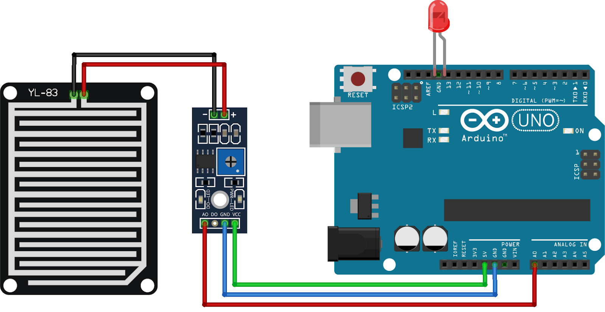

# Arduino Rain Sensor System  

This project demonstrates how to use a **Rain Sensor** with Arduino to detect rainfall and trigger an **LED/Buzzer/Relay** alert.  
It monitors both **analog intensity values** and **digital rain detection status**, displaying results on the Serial Monitor.  

---

## 🔧 Components Required
- Arduino Uno (or compatible board)  
- Rain Sensor Module  
- LED / Buzzer / Relay  
- Jumper Wires   

---

## ⚡ Features
- Reads **analog rain intensity** (0–1023)  
- Reads **digital rain detection** (0 or 1)  
- Displays live data in the **Serial Monitor**  
- Triggers an **alert** (LED/Buzzer/Relay) when rain is detected  

---

## ⚡ Circuit Diagram
   

---

## 🎥 Demo Video
Check out the working demo on my YouTube channel:  
👉 [Ecempire7](https://www.youtube.com/@Ecempire7)  

---

## 🚀 Steps to Run
1. Connect the rain sensor to Arduino (`Analog OUT → A0`, `Digital OUT → D7`).  
2. Connect an LED/Buzzer/Relay to pin `D13`.  
3. Upload the Arduino code from this repository.  
4. Open the Serial Monitor at **9600 baud**.  
5. Pour water on the sensor → **LED turns ON** and Serial Monitor shows *Raining*.  
6. Keep sensor dry → **LED turns OFF** and Serial Monitor shows *No Rain*.  
